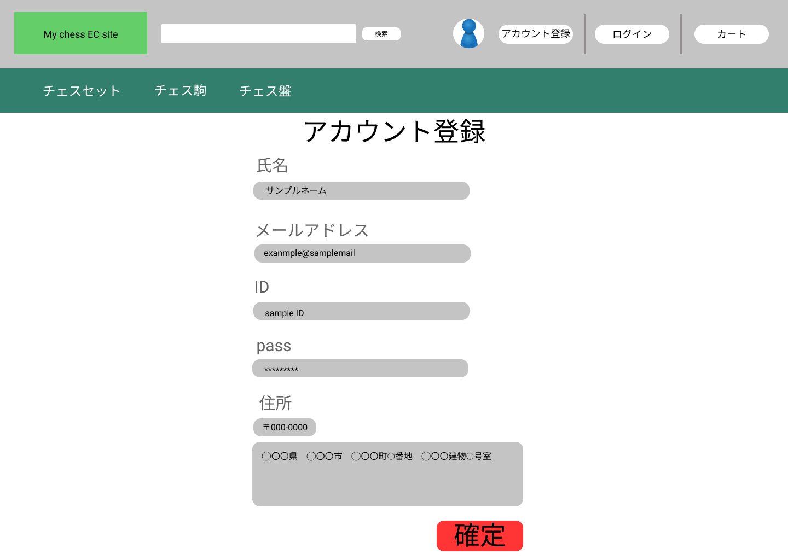

### 画面詳細図
# アカウント登録ページ
### [プロトタイプURL](https://www.figma.com/proto/mLtKn6PWgLvXVqKqVRbDCl/My-ECsite-Prototype?node-id=1%3A2&scaling=contain&page-id=0%3A1)

#### 対応DB要素の「???」は未定

|ID|要素|内容|アクション|カテゴリ,イベント|対応DB要素(テーブル名:カラム)|
|---|---|---|---|---|---|
|1|バナー|サイト名表示|クリック|遷移,トップページ|-|
|2|検索バナー|入力欄|テキスト入力|-|-|
|3|検索ボタン|ボタン|クリック|遷移,検索結果ページ|goods:goodsid,goodsname,goodsamount,category,goodsimage|
|4|プロフィールアイコン|ボタン(?)|クリック|遷移,プロフィールページ|user:userid,username,mail,pass,address|
|5|アカウント登録|ボタン|クリック|遷移,アカウント登録ページ|user:userid,username,mail,pass,address|
|6|ログイン|ボタン|クリック|遷移,ログインページ|user:mail,pass|
|7|カート|ボタン|クリック|遷移,カート内ページ|cart:cartquantity goods:id user:userid|
|8|チェスセット|リンク|クリック|遷移,検索結果ページ|goods:goodsid,goodsname,goodsamount,category,goodsimage|
|9|チェス駒|リンク|クリック|遷移,検索結果ページ|goods:goodsid,goodsname,goodsamount,category,goodsimage|
|10|チェス盤|リンク|クリック|遷移,検索結果ページ|goods:goodsid,goodsname,goodsamount,category,goodsimage|
|11|アカウント登録|-|-|-|-|
|12|氏名|テキスト|-|-|-|
|13|氏名入力ボックス|テキストボックス|入力|-|user:username|
|14|メールアドレス|テキスト|-|-|-|
|15|メールアドレス入力ボックス|テキストボックス|入力|-|user:mail|
|16|ID|テキスト|-|-|-|
|17|ID入力ボックス|テキストボックス|入力|-|user:userid|
|18|pass|テキスト|-|-|-|
|19|pass入力ボックス|テキストボックス|入力|-|user:pass|
|20|住所|テキスト|-|-|-|
|21|郵便番号入力ボックス|テキストボックス|入力|-|user:postalcode|
|22|住所入力ボックス|テキストボックス|入力|-|user:address|
|23|確定|ボタン|クリック|遷移,トップページ;作成,アカウント登録|username,mail,pass,address,postalcode|
