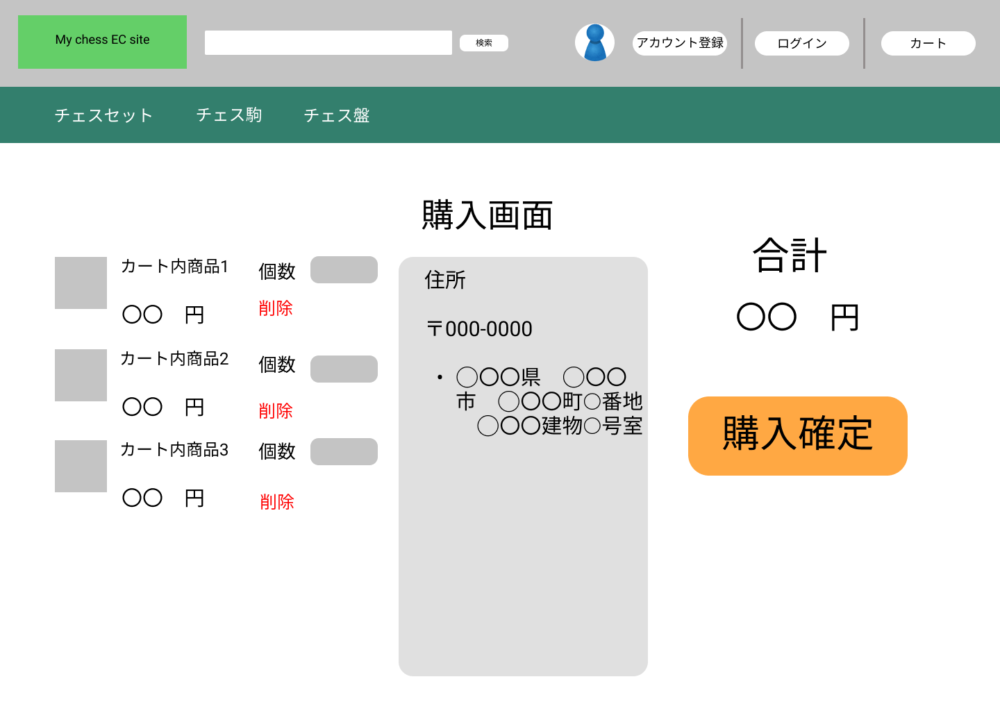

### 画面詳細図
# 購入確定
### [プロトタイプURL](https://www.figma.com/proto/mLtKn6PWgLvXVqKqVRbDCl/My-ECsite-Prototype?node-id=1%3A2&scaling=contain&page-id=0%3A1)

#### 対応DB要素の「???」は未定

|ID|要素|内容|アクション|カテゴリ,イベント|対応DB要素(テーブル名:カラム)|
|---|---|---|---|---|---|
|1|バナー|サイト名表示|クリック|遷移,トップページ|-|
|2|検索バナー|入力欄|テキスト入力|-|-|
|3|検索ボタン|ボタン|クリック|遷移,検索結果ページ|goods:goodsid,goodsname,goodsamount,category,goodsimage|
|4|プロフィールアイコン|ボタン(?)|クリック|遷移,プロフィールページ|user:userid,username,mail,pass,address|
|5|アカウント登録|ボタン|クリック|遷移,アカウント登録ページ|user:userid,username,mail,pass,address|
|6|ログイン|ボタン|クリック|遷移,ログインページ|user:mail,pass|
|7|カート|ボタン|クリック|遷移,カート内ページ|cart:cartquantity goods:id user:userid|
|8|チェスセット|リンク|クリック|遷移,検索結果ページ|goods:goodsid,goodsname,goodsamount,category,goodsimage|
|9|チェス駒|リンク|クリック|遷移,検索結果ページ|goods:goodsid,goodsname,goodsamount,category,goodsimage|
|10|チェス盤|リンク|クリック|遷移,検索結果ページ|goods:goodsid,goodsname,goodsamount,category,goodsimage|
|11|商品サムネイル|-|-|-|goods:goodsimage|
|12|商品名|テキスト|クリック|遷移,商品詳細ページ|goods:goodsname|
|13|商品価格|テキスト|-|-|goods:AmountofGoods|
|14|個数|テキスト-|-|-|-|
|15|個数セレクトボックス|セレクトボックス|クリック|個数選択|-|
|16|削除|テキスト|クリック|カート内商品削除|cart:goodsid,cartquantity|
|17|購入画面|テキスト|-|-|-|
|18|住所|テキスト|-|-|user:userid,address|
|19|合計|テキスト|-|-|-|
|20|合計金額|テキスト|-|-|cart:goodsid,cartquantity goods:AmountofGoods|
|||||||
