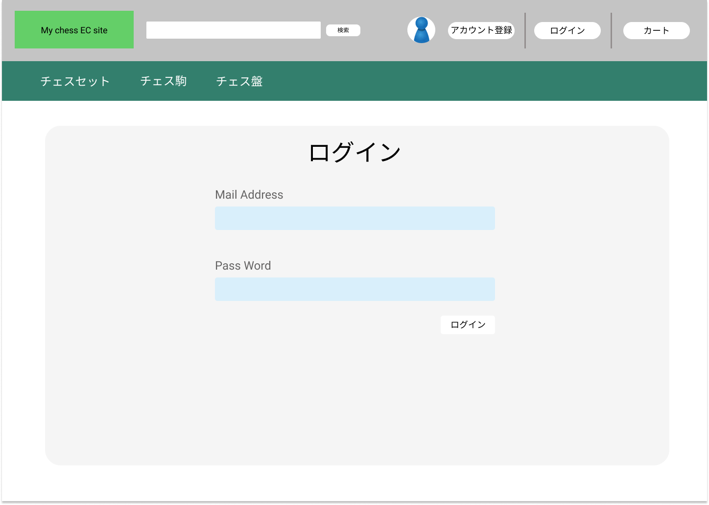

### 画面詳細図
# ログインページ
### [プロトタイプURL](https://www.figma.com/proto/mLtKn6PWgLvXVqKqVRbDCl/My-ECsite-Prototype?node-id=1%3A2&scaling=contain&page-id=0%3A1)

#### 対応DB要素の「???」は未定

|ID|要素|内容|アクション|カテゴリ,イベント|対応DB要素(テーブル名:カラム)|
|---|---|---|---|---|---|
